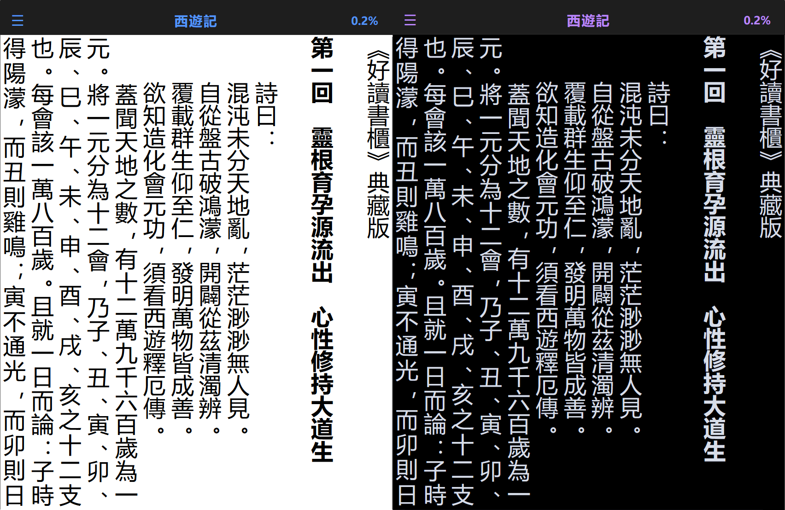
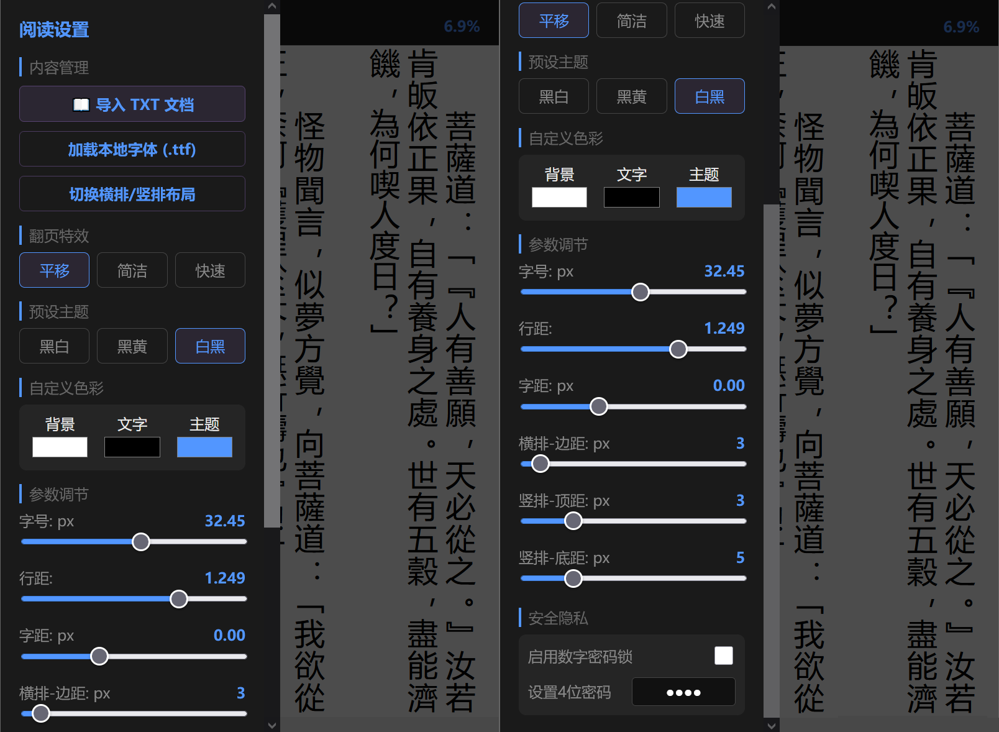

## 古籍阅读器

一款专为中文古籍和 TXT 纯文本设计的零权限轻量级 Android 离线 HTML 阅读器，不重新排版，支持点击、滑动、拖动，支持7M以内大文件。

  💻 <b>桌面端推荐：<a href="https://github.com/koukouck/webreader">PC 浏览器端阅读器</a></b>

## 操作说明

1.	系统与版本：本软件只支持 Android 12 以上。

2.	常用操作：点击标题栏导入图书、点击屏幕中心切换全屏、左上角图标点击进入设置、右上角进度点击搜索关键字、左侧上半部分点击切换背景、左侧上下滑动调整亮度、右侧上下滑动调整字号、底部滑动跳转位置、左右点击翻页、左右滑动翻页、竖排可左右拖动文字、横排上下拖动文字、设置中可开启数字密码(初始密码：1234)，可以改设其它密码，但不要忘记。

3.	布局说明：软件启动默认竖排，点击设置中的“布局切换”可以切换成横排。如果竖排模式下的引号不是直引号，可以点击两下“布局切换”重新加载。

4.	格式与限制：目前只支持 .txt 一种文档格式，是一个纯粹的 Android 
离线阅读器。竖排只支持左右翻页特效。横排只支持上下滚屏，不支持左右翻页特效。
5.	竖排排版说明：打开文档或选择新的字体后，可能出现排版不正确，两侧可能出现半行，可以通过调整字体大小（滑动屏幕右侧）、调整行距，来改变竖排界面的显示列数、文字左右位置，从而得到最佳排版效果。

6.	自定义配置：字体大小、边距等默认设置是作者自用偏好，你可以在设置中自行修改，或通过apk编辑器等，直接在 HTML 源码中修改任何参数。

7.	加载本地字体：由于现代浏览器/WebView 的安全限制，本地选择的字体文件在关闭阅读器或者页面刷新后，出于安全保护，软件无法直接通过路径重新访问本地文件，需要再选择一次，否则只能加载手机默认字体。或者也可以参照“自定义字体.txt”把指定字体放进软件。

8.	开源协议 (License)：本项目采用 MIT License 开源协议，您可以自由修改、分发及用于个人或商业项目。

## 截图

 ----------------------------------------------------------------------

## 推荐阅读

[《为什么会有人类》](https://freeskyz.saganlu.win/go/mankind) (2023年1月20日)&emsp;/[《为什么要救度众生》](https://freeskyz.saganlu.win/go/save) (2023年4月17日)&emsp;/[《为什么人类是迷的社会》](https://freeskyz.saganlu.win/go/society) (2024年9月30日)

## 推荐电子书 

《共产主义终极目的》https://github.com/goodcba/GCC

《魔鬼在统治着我们的世界》https://github.com/gofun72/telove/blob/master/魔鬼在统治着我们的世界.epub

## 更多电子书下载

翻墙部落https://github.com/osurf/szdy

禁书免翻墙下载https://github.com/xijinping0/gfw-breaker-books

## 浏览真实信息

令人震惊的真相https://github.com/1992513/www/blob/master/README.md?w#1

